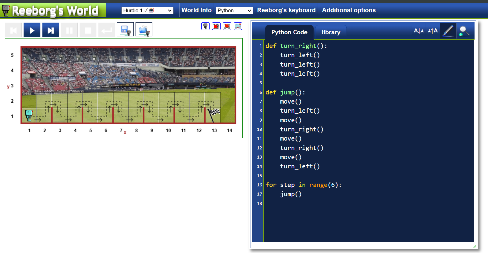
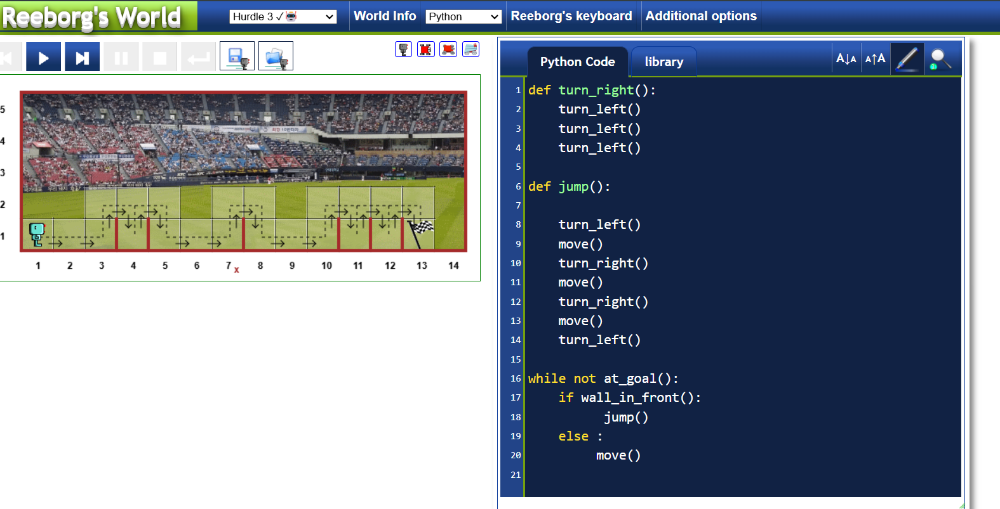
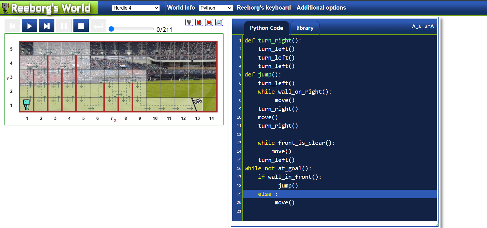

<!-- 
https://reeborg.ca/reeborg.html?lang=en&mode=python&menu=worlds%2Fmenus%2Freeborg_intro_en.json&name=Hurdle%201&url=worlds%2Ftutorial_en%2Fhurdle1.json 
-->

<!-- i make this at above link  -->

<!-- now for while loop -->

<!-- same link open hurdle3 -->

<!-- hurdle 4 with variable movement
 -->

 <!--  lec-11 and 13 kr lena -->